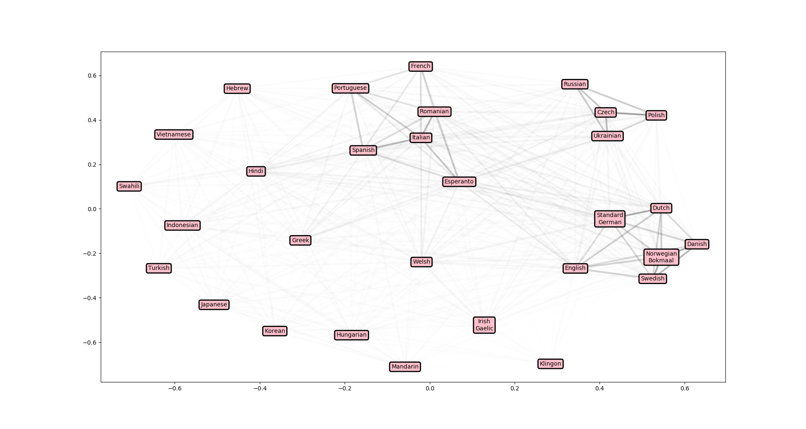

# Language Distances
Visualise distances between natural languages.

This uses the [ASJP](http://asjp.clld.org/) database to determine distance between pairs of languages. I use the Normalized Levenshtein Distance as described [here](http://www.sciencedirect.com/science/article/pii/S0378437110003997), followed by [MDS](http://scikit-learn.org/stable/modules/generated/sklearn.manifold.MDS.html) to (approximately) map the calculated distance matrix onto a 2D surface. It gives some quite nice clustering.

To change the languages plotted, just change the 'duolingo' variable. Language codes are normally as you'd expect, but can be checked in the dataset.tab file.

